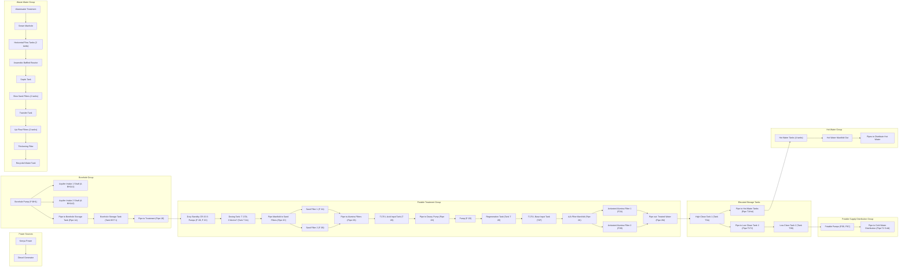

## Mermaid Flowchart Mind Map for KTC System Elements

```
graph LR
    subgraph "Power Sources"
        A[Kenya Power] --> B[Diesel Generator]
    end
    subgraph "Borehole Group"
        C[Borehole Pump (P-BH1)]
        C --> D{Aquifer Intake 1 Shaft (A BH1A1)}
        C --> E{Aquifer Intake 2 Shaft (A BH1A2)}
        C --> F[Pipe to Borehole Storage Tank (Pipe 1A)]
        F --> G[Borehole Storage Tank (Tank BST 1)]
        G --> H[Pipe to Treatment (Pipe 1B)]
    end
    subgraph "Potable Treatment Group"
        H --> I[Duty Standby CR 15-5: Pumps (P 2B, P 2C)]
        I --> J[Dosing Tank: T 170L Chlorine? (Tank T 2A)]
        J --> K[Pipe Manifold to Sand Filters (Pipe 2C)]
        K --> L[Sand Filter 1 (F 2A)]
        K --> M[Sand Filter 2 (F 2B)]
        L --> N[Pipe to Alumina Filters (Pipe 2G)]
        M --> N
        N --> O[T170 L Acid Input Tank (T 2D)]
        O --> P[Pipe to Davey Pump (Pipe 2H)]
        P --> Q[Pump (P 2D)]
        Q --> R[Regeneration Tank (Tank T 2E)]
        R --> S[T170 L Base Input Tank (T2F)]
        S --> T[A/A Filter Manifold (Pipe 2K)]
        T --> U[Activated Alumina Filter 1 (F2A)]
        T --> V[Activated Alumina Filter 2 (F2B)]
        U --> W[Pipe out: Treated Water (Pipe 2M)]
        V --> W
    end
    subgraph "Elevated Storage Tanks"
        W --> X[High Clean Tank 1 (Tank T3A)]
        X --> Y[Pipe to Low Clean Tank 2 (Pipe T1T2)]
        Y --> Z[Low Clean Tank 2 (Tank T3B)]
        X --> AA[Pipe to Hot Water Tanks (Pipe T1Hot)]
    end
    subgraph "Potable Supply Distribution Group"
        Z --> AB[Potable Pumps (P3B, P3C)]
        AB --> AC[Pipe to Cold Water Distribution (Pipe T2 Cold)]
    end
    subgraph "Hot Water Group"
        AA --> BB[Hot Water Tanks (4 tanks)]
        BB --> CC[Hot Water Manifold Out]
        CC --> DD[Pipes to Distribute Hot Water]
    end
    subgraph "Waste Water Group"
        EE[Wastewater Treatment] --> FF[Sewer Manhole]
        FF --> GG[Horizontal Flow Tanks (2 tanks)]
        GG --> HH[Anaerobic Baffled Reactor]
        HH --> II[Septic Tank]
        II --> JJ[Slow Sand Filters (2 tanks)]
        JJ --> KK[Transfer Tank]
        KK --> LL[Up-Flow Filters (2 tanks)]
        LL --> MM[Thickening Filter]
        MM --> NN[Recycled Water Tank]
    end
```

This mermaid flowchart mind map visually represents the flow of water and treatment processes within the KTC system. The diagram is based on the element list previously generated from the sources you provided. It is organized into the main functional groups found within the KTC system.

It is important to note that:

- **This diagram simplifies the complex interactions and connections between the elements.** The provided sources do not detail all the connections and control systems involved, so this diagram only represents a high-level overview.
- **Some specific pipe and sensor information was omitted for clarity.** For detailed information on individual pipes, sensors, and controls, refer to the element list.
- **The Waste Water Group is depicted as a separate flow.** More information on its integration with the Potable Water system is needed for a complete representation.

## Codebook for Mermaid Flowchart Elements

|Element Label|Element Name|Source(s)|
|:--|:--|:--|
|A|Kenya Power||
|B|Diesel Generator||
|C|Borehole Pump (P-BH1)||
|D|Aquifer Intake 1 Shaft (A BH1A1)||
|E|Aquifer Intake 2 Shaft (A BH1A2)||
|F|Pipe to Borehole Storage Tank (Pipe 1A)||
|G|Borehole Storage Tank (Tank BST 1)||
|H|Pipe to Treatment (Pipe 1B)||
|I|Duty Standby CR 15-5: Pumps (P 2B, P 2C)||
|J|Dosing Tank: T 170L Chlorine? (Tank T 2A)||
|K|Pipe Manifold to Sand Filters (Pipe 2C)||
|L|Sand Filter 1 (F 2A)||
|M|Sand Filter 2 (F 2B)||
|N|Pipe to Alumina Filters (Pipe 2G)||
|O|T170 L Acid Input Tank (T 2D)||
|P|Pipe to Davey Pump (Pipe 2H)||
|Q|Pump (P 2D)||
|R|Regeneration Tank (Tank T 2E)||
|S|T170 L Base Input Tank (T2F)||
|T|A/A Filter Manifold (Pipe 2K)||
|U|Activated Alumina Filter 1 (F2A)||
|V|Activated Alumina Filter 2 (F2B)||
|W|Pipe out: Treated Water (Pipe 2M)||
|X|High Clean Tank 1 (Tank T3A)||
|Y|Pipe to Low Clean Tank 2 (Pipe T1T2)||
|Z|Low Clean Tank 2 (Tank T3B)||
|AA|Pipe to Hot Water Tanks (Pipe T1Hot)||
|AB|Potable Pumps (P3B, P3C)||
|AC|Pipe to Cold Water Distribution (Pipe T2 Cold)||
|BB|Hot Water Tanks (4 tanks)||
|CC|Hot Water Manifold Out||
|DD|Pipes to Distribute Hot Water||
|EE|Wastewater Treatment||
|FF|Sewer Manhole||
|GG|Horizontal Flow Tanks (2 tanks)||
|HH|Anaerobic Baffled Reactor||
|II|Septic Tank||
|JJ|Slow Sand Filters (2 tanks)||
|KK|Transfer Tank||
|LL|Up-Flow Filters (2 tanks)||
|MM|Thickening Filter||
|NN|Recycled Water Tank||

This codebook serves as a reference to connect the elements in the Mermaid flowchart mind map back to their corresponding names and source materials.

---
Errors; Claude repairs errors:

Let me help identify the issue. In Mermaid flowcharts, nodes that contain spaces and special characters need to be wrapped in quotes. Let me create a corrected version:




The main changes I made:
1. Added double quotes around all node labels that contain spaces or special characters
2. Removed the curly braces from nodes D and E (which were incorrectly marked as decision nodes)
3. Maintained the same structure but with proper Mermaid syntax

This should now render correctly. The curly braces `{}` are typically used for decision nodes in flowcharts, but in this case, the aquifer intakes are regular components, so they should use regular square brackets `[]` like the other nodes.

Would you like me to make any other adjustments to the diagram?

---
[[NotebookLM]] created the mermaid rendering from a list of components.