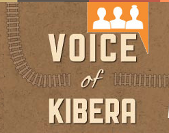
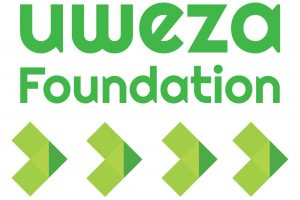

# Mind Map

# Kenyan News Organizations

## Kenya Moja

### 

- Compendium of Audio and Video Clips from ntv, k24, Citizen
	- https://www.kenyamoja.com/

## Citizen TV

### 

- https://citizentv.co.ke/

## K24

### 

- https://www.k24tv.co.ke/

## KBC

### 

- https://www.kbc.co.ke/

## KTN (Standard)

### 

- https://www.standardmedia.co.ke/ktnhome/

## Nairobi News

### 

- http://nairobinews.co.ke/

## NTV (Nation)

### 

- https://ntv.nation.co.ke/

## Taifa Leo

### 

- https://taifaleo.nation.co.ke/

## The Star

### 

- https://www.the-star.co.ke/

## Africa News

### AfricaNews
- 

	- https://www.africanews.com/

### The Africa Report
- 

	- https://www.theafricareport.com/

### All Africa
- 

	- https://allafrica.com/

### Science
- 

	- https://www.sciencemag.org/news/2020/03/ticking-time-bomb-scientists-worry-about-coronavirus-spread-africa

## Business Daily

### 

- https://www.businessdailyafrica.com/

## The East African

### 

- https://www.theeastafrican.co.ke/

## The Nation

### 

- https://www.nation.co.ke/

## The Standard

### 

- Podcasts
	- https://www.standardmedia.co.ke/podcasts
- https://www.standardmedia.co.ke/
- JOHN ATAMBO NGOKO  
  STANDARD GROUP  
  BUREAU CHIEF

## The Star

### 

- https://www.the-star.co.ke/

## Voice of Kibera

### 

- http://www.voiceofkibera.org/

## Kibera News Network

### https://twitter.com/KnnKibera

## Kibera Stories

### 

- https://www.kiberastories.com/news/
	- Bryan Otieno 
		- 

## Kibera Organizations

### Kibera Town Centre
- 

	- https://www.humanneedsproject.org/tags/kibera-town-centre

### Uwezakenya
- 

	- https://uwezakenya.org/category/kibera-news/

### Carolina for Kibera
- 

	- https://carolinaforkibera.org/

### Shofco
- 

	- https://www.shofco.org/

### MapKibera
- 

	- https://www.mapkibera.org/
